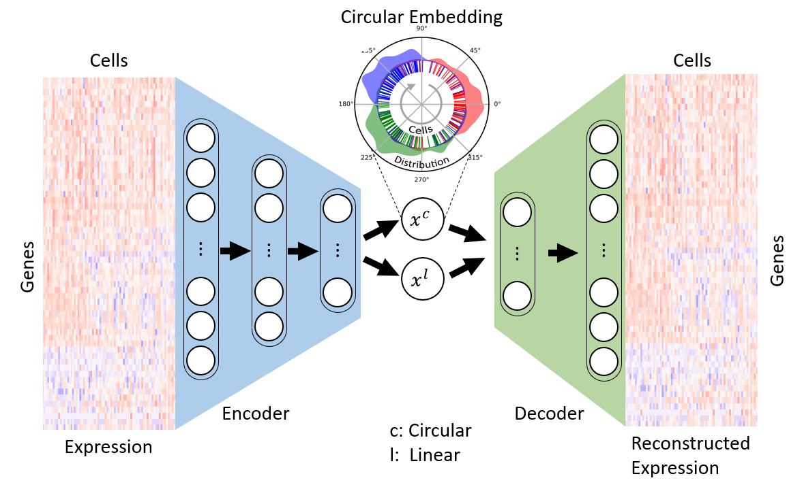

# Cyclum

## Introduction
Cyclum is a package to tackle cell cycle. It provides methods to recover cell cycle information and remove cell cycle factor from the scRNA-seq data. The methodology is to rely on the circular manifold, instead of the marker genes. We provide an Auto-Encoder based realization at this time, and we are adding Gaussian Process Latent Variable Model soon.

## Tutorials
We provide a [one-click self-contained demo](https://github.com/KChen-lab/Cyclum-Demo) ships with its dataset, which shows how to start with an expression matrix, then decide the optimal dimensionality, and finally calculate the circular pseudotime. 

More examples are available in [test/notebooks](https://github.com/KChen-lab/Cyclum/tree/master/tests/notebooks), where there is a detailed [table of contents](https://github.com/KChen-lab/Cyclum/blob/master/tests/notebooks/README.md). 



Our paper has been published on Nature Communication: [Liang S, Wang F, Han J, Chen K. Latent periodic process inference from single-cell RNA-seq data. Nat Commun 11(1):1441, 3/2020. e-Pub 3/2020. PMID: 32188848](https://www.nature.com/articles/s41467-020-15295-9). [old preprint](https://www.biorxiv.org/content/10.1101/625566v1) has also been uploaded to BioRxiv. Documentation for submodules and classes in the Cyclum Python module is available as a [website](https://kchen-lab.github.io/Cyclum/docs/_build/html/index.html). Explanations of other files in [test](https://github.com/KChen-lab/Cyclum/tree/master/tests) are available as `README.md` in the corresponding folders.

## Installation
You can install cyclum by running the following commands, in a directory you desire.

```bash
conda create -n cyclum python=3.7 pip
conda activate cyclum
git clone https://github.com/KChen-lab/Cyclum.git
cd Cyclum
pip install .
```
:warning: **This will install cyclum and its dependencies to your system, which affects more than just this directory.** Thus, we highly recommend virtual environment such to avoid messing up your system / breaking dependencies of other software. [Miniconda](https://docs.conda.io/en/latest/miniconda.html) may be a good choice if you have not already installed one.

You can then run Jupyter notebook simple using the following command.
```bash
jupyter notebook
```
A browser window will open showing the directory, where you can go to `tests/notebokks` to view/run the exmaples.

:warning: Please be advised that pip will attemp to install the latest version of the dependencies, which is different from where this program is tested (shown in the table below). TensorFlow < 1.15.2 has a known security issue and are not recommended. However, you can force pip to install specific versions by change `install_requires=[...]` in `setup.py` to `install_requires=['keras==2.2.4', 'numpy==1.16.5', 'pandas==0.25.2', 'scikit-learn==0.21.3', 'h5py==2.9.0', 'jupyter==1.0.0', 'matplotlib==3.1.1', 'tensorflow==1.14.0']`.

## Use as portable software
You can also use cyclum as a portable software, without installing. All the notebooks contains code that add cyclum to the path, so that you can run them directly. However, please make sure the dependencies are fulfilled. 

### Software dependencies: 
Cyclum was tested on these package versions. Please make sure that you have TensorFlow 1.x. Cyclum is compatible with newer versions shown in the "Latest tested" column.
|Software    | Version| Latest tested |
|------------|--------|---------------|
|python      | 3.7.4  | 3.7.6         |
|keras       | 2.2.4  | 2.3.1         |
|tensorflow  | 1.14.0 | 1.15.2        |
|numpy       | 1.16.5 | 1.18.1        |
|pandas      | 0.25.2 | 1.0.1         |
|scikit-learn| 0.21.3 | 0.22.1        |
|h5py        | 2.9.0  | 2.10.0        |
|jupyter     | 1.0.0  | 1.0.0         |
|matplotlib  | 3.1.1  | 3.1.3         |

We recommend Miniconda to manage the packages. The code should work on packages of newer versions, but in case it fails, you can return to the specific version by, for example, `conda install python=3.7.4`.

### System requriment:
The code is on Debian GNU/Linux 10 (buster) with both CPU and GPU. The code should run on most mainstream systems (Linux, Mac, Windows) supporting Tensorflow.

## Collaborate with other tools

### Transferring data between python and R
Although Python is a good data analysis tool in addition to a general programing language, researchers may want to use R, which is more focused on statistics. Cyclum is implemented in python, but in order to help use both languages, we implemented `mat2hdf` and `hdf2mat` in both Python and R, to help transferring data back and forth rapidly. In general, the correspondence of data structures in R and Python are: unnamed matrices -- 2D numpy.array, named matrices -- pandas.DataFrame, data.frame -- pandas.DataFrame. (Prerequisites: `hdf5r` in R, `h5py` in python.)

### Transferring data to GSEA
[GSEA](http://software.broadinstitute.org/gsea/index.jsp) is a powerful tool to perform downstream gene enrichment analysis. We implemented in R...
- `mat2txt`, which writes a expression matrix to a GSEA compatible `.txt` file (Prerequisite: `data.table`, for much faster writing than `write.table`),
- `vec2cls`, which writes phenotypes (either discrete, e.g., cell type, or continuous, e.g., pseudotime) to a GSEA compatible `.cls` file,
- `mat2cls`, which writes multiple sets of phenotypes (continuous only, e.g., multiple PCs) to a GSEA compatible `.cls` file.

## The old version
We revised almost everything, except for the concept of using sinusoidal function in an autoencoder to find circular biological processes *ab initio*. The autoencoder is now rewritten using [keras](https://keras.io/), in a more readable way. We hope this will help researchers who want to experiment similar network structures. We also implemented class `cyclum.tuning.CyclumAutoTune`, which automatically select the proper number of linear components to help find the "most circular" manifold. The old version is kept in [`old-version`](old-version).
